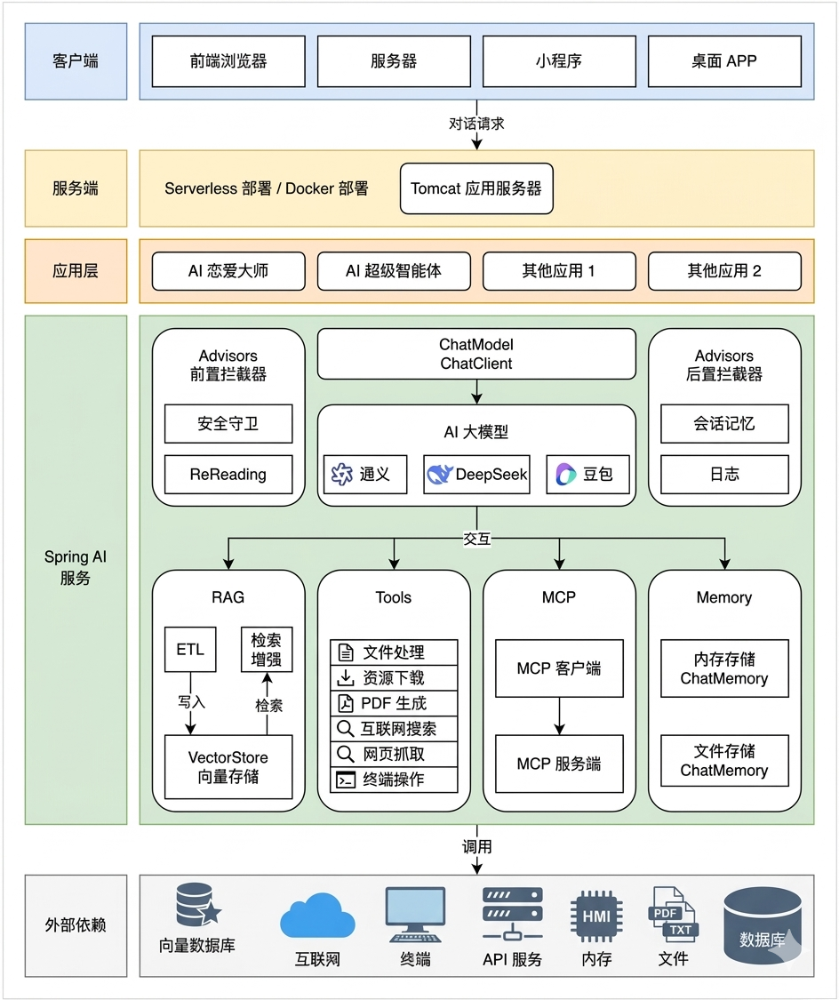
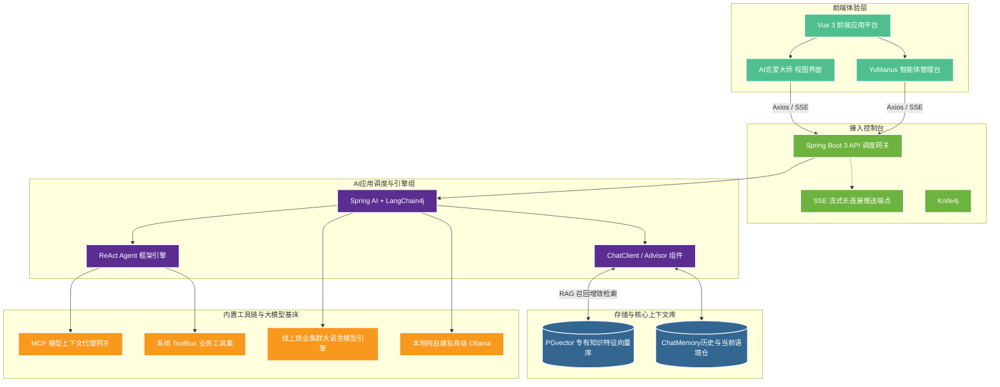
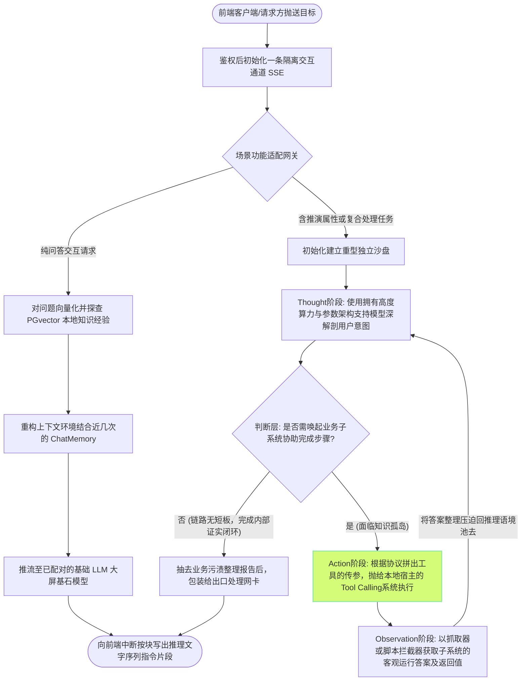

# AI 超级智能体项目 - 全栈系统概要与架构说明

> 本系统为“AI 超级智能体”的核心代码库。整个项目旨在通过开发 **AI 恋爱大师应用 + 拥有自主规划能力的超级智能体**。

## 平台业务矩阵

这是一套以 **AI 开发实战** 为驱动的工程。采用前后端分离的架构与基于 Tool Calling 和 ReAct 范式的 AI 引擎深度通信，目前已经跑通以下两大核心功能场景：

- 💬 **AI 恋爱大师**：智能情感顾问，可以依赖云端与本地大模型解决用户的情感问题，为用户提供贴心情感指导。不仅支持多轮对话与流式返回（基于 SSE 原生推送），还底层依赖自定义针对性语录的 RAG 检索知识库。
- 🤖 **AI 超级智能体 (YuManus)**：全能型自主规划智能体底座引擎。用户输入抽象或者长链路的复杂需求后，AI 会根据意图自主拆解流程、推理并在内部循环反思；同时它能主动调用一系列集群与云端扩展工具（如联网搜索、网页抓取预校验、PDF 生成、MCP图片提取、系统文件系统操作等），自动规划并最终面向前端交付闭环结果。

## 整体架构与详细技术栈

本项目作为大型复合 AI 应用平台，涵盖了从前端交互体验到底层大语言模型的系统性研发体系，其中**后端引擎为项目的核心控制枢纽**。

### 📊 系统架构与工作流示意图

为了帮助开发者更加宏观、直观地了解本全栈分布式应用的设计思想及运转全景，请参见下方的架构演示图与流转说明：

> **核心项目架构图**



> **动态链路流转图 (基于 Mermaid 渲染)**

**1. 整体系统组件分层架构图**



**2. YuManus 智能体处理复杂多级命令链路（模拟 Manus 原理层）**



### ⚙️ 后端级及核心扩展技术栈清单
后端主服务为整个平台提供了所有关键功能：

- **核心基底**：
  - **Java 21 + Spring Boot 3**：企业级最前沿的 Web 服务框架，承载所有的业务调度、数据持久化及依赖注入环境。
  - **Knife4j**：生成高质量的接口文档体系，方便各个模块级别的压测与联调。

- **AI 大模型通信层**：
  - **Spring AI + LangChain4j**：作为通用桥接抽象层，用来抹平线上百炼大模型和本地自建模型（如 Ollama）的网络通讯异构差异，统一完成从单点对话响应、Advisor增强补丁到长文对话聊天（ChatMemory）持久化的保障职责统筹。
  
- **RAG 数据构建工具群建制**：
  - **PGvector 数据库**：依托于 Postgres 插件系统的专业级向量引擎。专门针对业务预构建了针对大批量非结构文本快速入库分析、海量问答的向量抽取余弦比对等数据侧链路。
  
- **智能体及扩展 Agent 工具集群层（Tool Calling 与 MCP 生态）**：
  - **ReAct 引擎架构原理应用**：构建了类似市面先进超级个体（像 Manus 演示模型）所需的：从大盘拆解子任务，到多步骤交替独立反思行动并重构的完整业务态。极客化的降低了幻觉产生。
  - **MCP 开放通信网桥**：将系统的工具组件部署出独立架构之外进行外部交互与挂载，如提供给外界进行调用搜图。
  - **内部工具箱底座**：在 Tool Calling 层提供了爬虫探路者组件（Jsoup）、渲染出单器（通过 iText 直接向客户端下发生成好的 PDF 体验文件）等。
  - 高频通信优化：基于 **Kryo 序列化器系统** 使繁杂冗长的上下文记忆与大对象变量能够达到快速保存加载，节省响应的 IO 时间。

### 🎨 前端展现层 (yu-ai-agent-frontend)
采用直观轻巧的最新理念提升 B/S 环境对话质量：
- 采用 **Vue 3** 单页面应用模型与 **Vite** 的极速响应引擎。
- 通信层基于原生底层对 **SSE (Server-Sent Events) 协议流缓冲分块接收适配**，完美兼容各大浏览器对于打字机效果“字字显形”的视觉震撼支持。

## 💡 快速入门与联调

由于这是一个高度耦合前后方链路且具有服务端主导性的产品。在本地开启研发环境之前：请妥协先运转起后端的 Spring Boot 引擎套件。服务挂载预设端口默认为 `http://localhost:8123`，并检查 Postgres(含 PGvector) 服务在线。

前台界面的启动参照以下方法：

```bash
# 1. 切换到前端子项目路径
cd ./yu-ai-agent-frontend

# 2. 拉包
npm install

# 3. 启本地研发服务监听 
npm run dev
```
