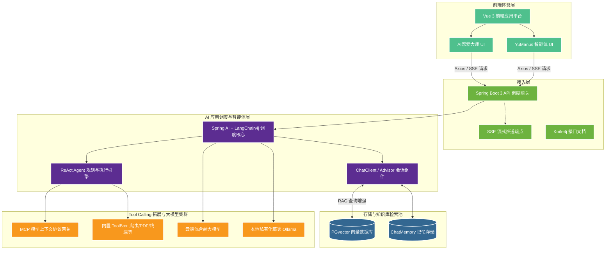
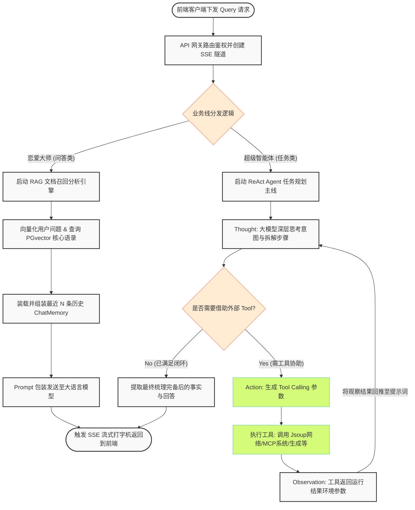

# AI 超级智能体项目 - 系统架构与业务逻辑设计

本文档包含了当前系统的**整体架构图**与核心的**系统业务逻辑图**，基于 Mermaid 语法生成。

## 1. 整体系统架构图

该架构图展示了从前端用户界面、网关接入、后端 AI 调度核心，到外围工具调用与数据库底座的分层设计。

## 2. 核心系统业务逻辑流转图 (以智能体响应链路为例)

该流程图详尽剖析了用户发送一条复杂请求后，AI 后台是如何经过 RAG 补充、大模型深度规划（ReAct 循环），并最终返回结果的流转过程。

